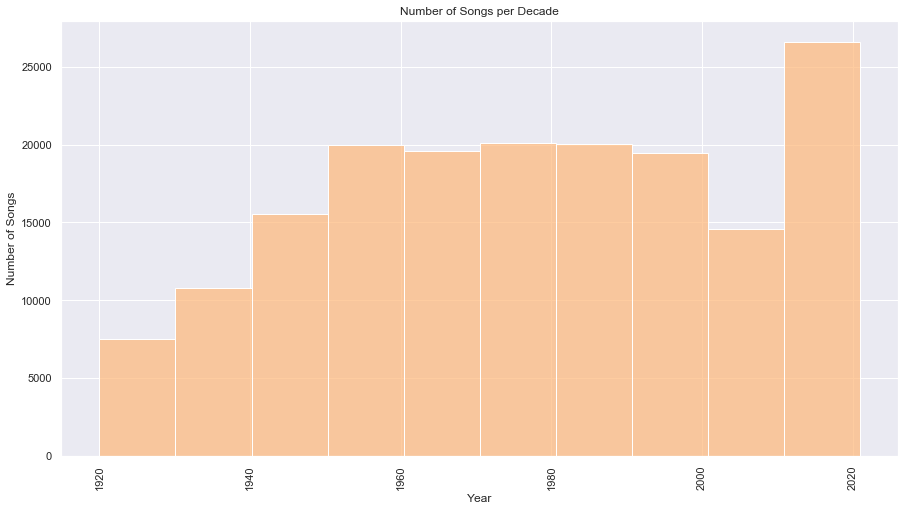
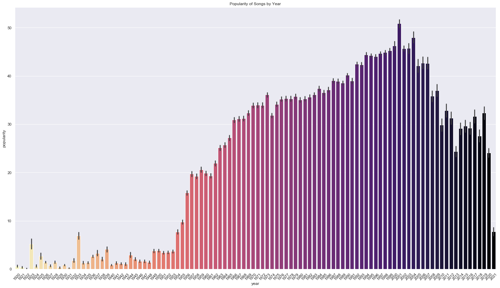
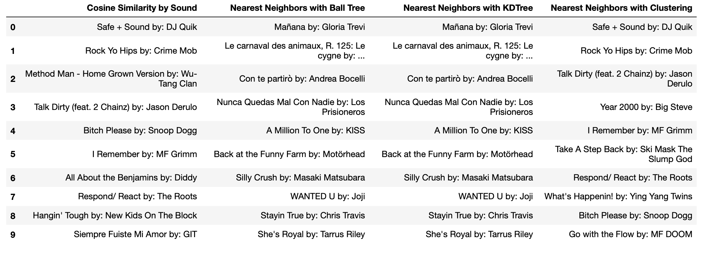
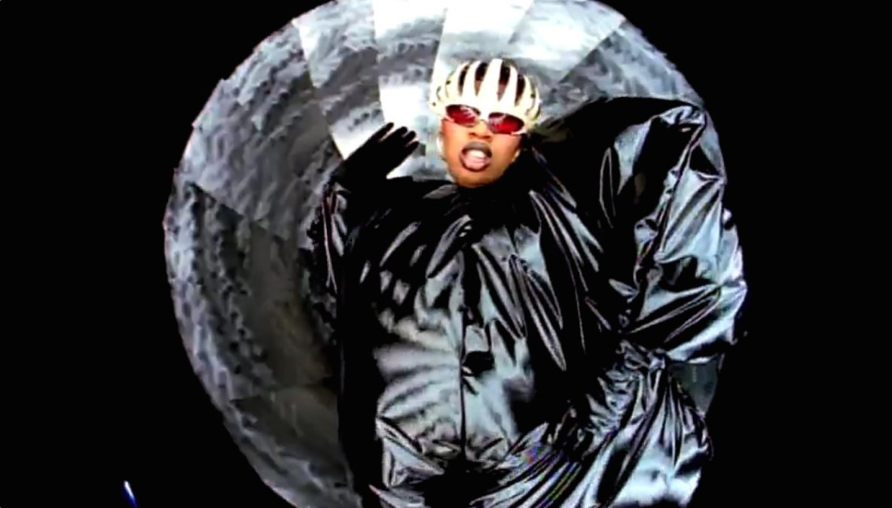

# Song Recommendation System Using Spotify Data

### Business Case

The production company behind a successful YouTube channel for 8-bit-style covers is looking for a new way to discover what new songs to cover. The objective is to find songs similar to those currently generating most of their traffic from YouTube Suggested. They assume that sonically similar songs are likely to be of interest to the same listeners. Thus, they hired us to develop a recommendation system that utilizes sound properties to offer similar song recommendations to their team.

### The Data

[Link to dataset on Kaggle](https://www.kaggle.com/yamaerenay/spotify-dataset-19212020-160k-tracks)

To train our recommendation system, we use a dataset provided by Kaggle containing information on over 170,000 songs. Most of the dataset features refer to the musical properties of an individual song: tempo, key, acousticness, etc. 

### Data Cleanup and EDA

The data is incredibly clean, and ther are no missing values. 

During the EDA portion of my work, I focused on exploring how music has changed over the years/decades. I was mainly interested in seeing how popular music from different years is and whether we have sufficient data from these years to build a recommender system. 

It appeared that songs from the late 1990s and early 2000s had amassed the highest popularity. For my main test song, I picked Missy Elliott's "The Rain (Supa Dupa Fly)." It's a song that my clients are currently preparing for release, and it happens to be from the same era. 

### Methodology: 

1. Do a recommender that returns similar songs by the same artist, using cosine similarity.
2. Build a recommender that returns similar songs from other artists where similarity is determined by sound properties (also using cosine similarity)
3. Use the unsupervised Nearest Neighbors algorithms (both with Ball Tree and KD Tree) to return recommendations from all artists.
4. Improve on the Nearest Neighbors by adding a cluster feature to the DataFrame and removing other less relevant features.

### Results

The recommendations in the recommender using Cosine Similarity by Sound and Nearest Neighbors with Clustering are very similar. This is not surprising as both are determined primarily by sound properties; however, they use different distance metrics: cosine similarity vs. euclidean distance. 

I will use both recommenders to pull recommendations for my client, then compare them side-by-side.

### FUTURE WORK

* Add genres to the mix of features and see if that improves the recommendations by the two recommenders
* Add the ability to recommend based on multiple songs as input
* Explore if the recommenders are more accurate for particular genres. Based on random trials, they deliver more accurate recommendations for hip-hop and R&B songs.

